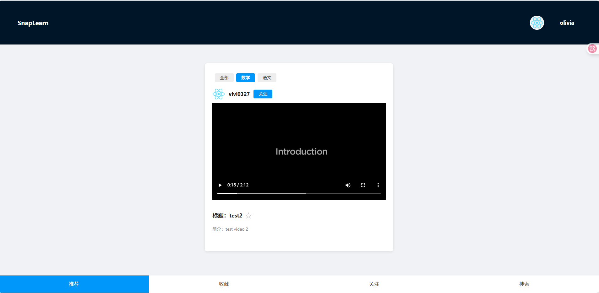

<p align="right">
  🌐 Read this in:
  <a href="README.md">中文</a> |
  <a href="README.en.md">English</a>
</p>

# 📚 SnapLearn - Learn Smarter, 10 Minutes at a Time

> **AI × Education × Microlearning × Open Source Community**
>
> SnapLearn is an innovative short-video learning platform, powered by certified educators, AI, and a passionate open-source community. We believe education should be open, smart, fun, and built by everyone!

---

## 🎬 What is SnapLearn?

SnapLearn is a community-driven platform where users learn efficiently through **short videos (≤10 min)** created by **certified teachers** (Master's degree or teaching certificate required). Users filter content by their education level and interests, and AI helps with exercises, grading, and learning hints.

🧩 Learn in your spare moments — get systematic knowledge  
📚 AI + EdTech — smarter learning experience  
🌍 Anyone can learn, anyone can teach (if certified!)

---

## 🌟 Project Highlights

- **Quality Content**: Only certified educators can upload, ensuring high standards.
- **AI-powered Learning**: AI grading and guided hints for smarter study.
- **Microlearning Experience**: Short videos, swipe to learn anytime.
- **Personalized Recommendations**: Filter by education, subject, and interests.
- **Open Source Collaboration**: Built by developers, teachers, and learners together.

---

## ✨ Core Features

| Feature | Description |
|---------|-------------|
| 🎓 **Educator Verification** | Only certified teachers can upload content, ensuring quality |
| 📹 **Short Video Uploads** | Videos are tagged by subject and education level |
| 🧭 **Smart Content Feed** | Swipe to learn, TikTok-style, with personalized recommendations |
| 📝 **Attach Exercises (WIP)** | Teachers can add exercises (objective & subjective) |
| 🤖 **AI Learning Assistant (Planned)** | AI guides problem-solving, never gives direct answers, grades subjective questions |
| 🔍 **Advanced Filtering** | Users filter by education level and subject |
| 📌 **Wrong Answer Log & Favorites (Planned)** | Save mistakes and favorite content |
| 🌟 **Open Source Community** | Developers, educators, designers, and learners all welcome! |

---

## 🖼 Product Previews

> 👇 Contribute your screenshots and demo videos!
- Main feed (short video swiping)
- Video upload flow
- Teacher verification dashboard
- AI-powered learning (planned)

> Example placeholders:  
>   
> 

---

## 🚀 Getting Started (For Developers)

> SnapLearn is a full-stack project using **React** (frontend) and **Django REST Framework** (backend).

### 0️⃣ Prerequisites

- Node.js >= 16
- Python >= 3.8
- Git
- (Recommended) Python virtual environment (venv/conda)

### 1️⃣ Clone the repo

```bash
git clone https://github.com/Yiteng-CHEN/snaplearn.git
cd snaplearn
```

2️⃣ Start the frontend
```bash
cd snaplearn-frontend
npm install
npm start
```

3️⃣ Start the backend
```bash
cd snaplearn_backend
pip install -r requirements.txt
python manage.py migrate
python manage.py runserver
```

4️⃣ (Optional) Run tests
```bash
# Frontend
npm test
# Backend
python manage.py test
```

💡 See [FAQ.md](docs/FAQ.md) for common issues.

🧠 Tech Stack Overview
- Frontend: React, Axios, Ant Design
- Backend: Django, Django REST Framework
- Database: SQLite (default), MySQL/PostgreSQL (optional)
- AI Layer: OpenAI/custom NLP (planned)
- Media Storage: Local or OSS
- Docker support (planned)

---

## 👥 Join the SnapLearn Community

SnapLearn is an **open, inclusive, and innovative** education community. We welcome everyone passionate about building the future of learning — developers, teachers, designers, and lifelong learners!

### You can contribute:

- 💻 New features (frontend/backend/AI/NLP)
- 🐞 Bug fixes & performance improvements
- 🎨 UI/UX design
- 📚 Content suggestions & video uploads
- 🌍 Translations & internationalization (i18n)
- 📢 Community outreach & documentation

> 👉 See: [CONTRIBUTING.md](CONTRIBUTING.md) for details  
> 👉 Submit issues: [GitHub Issues](https://github.com/Yiteng-CHEN/snaplearn/issues)  
> 👉 Join discussions: [GitHub Discussions](https://github.com/Yiteng-CHEN/snaplearn/discussions)

---

## 📌 Roadmap

- ✅ Educator verification & video upload
- ✅ Content feed & personalized recommendations
- ✅ Exercise attachments per video
- ✅ AI grading for subjective questions
- 🚧 AI-powered learning hints
- ✅ User wrong answer log & favorites
- 🚧 Multi-language support
- 🚧 Docker deployment
- 🚧 Mobile app (Flutter/React Native)

---

## 💬 Community & Contact

| Channel                    | Status                                                |
| -------------------------- | ----------------------------------------------------- |
| 💬 GitHub Discussions      | ✅ [Open](https://github.com/Yiteng-CHEN/snaplearn/discussions) |

> ⚠️ If you see a 404 error, please enable the Discussions feature in your GitHub repository settings:  
> Repository Home → Settings → Features → Check Discussions

| 📧 Email Contact           | [eatonchen@hotmail.com](mailto:eatonchen@hotmail.com) |
| 🧑‍🤝‍🧑 WeChat / Telegram | ⏳ Coming soon                                         |

---

## 📄 License

This project is open-sourced under the MIT License.  
You are free to use, modify, and distribute — just keep the original copyright.

---

## 🙌 Thanks & Call to Action

SnapLearn's vision: Make high-quality education accessible, efficient, and fun for everyone, everywhere.  
We believe open source can build a smarter, warmer, and more innovative learning community.

If you're:

- A developer → Submit PRs & Issues
- An educator → Become a certified teacher and upload content
- A learner → Use SnapLearn and share your feedback
- A designer → Help us improve the UI/UX

⭐ **Star this project and join us — let's build the next-generation education platform together!**

> We welcome all feedback, suggestions, and PRs. Join us and make a difference!