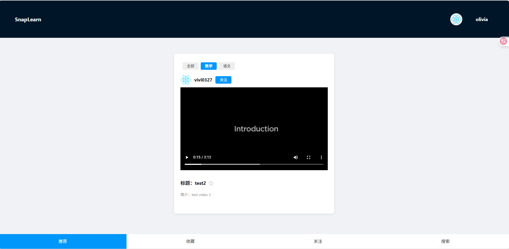
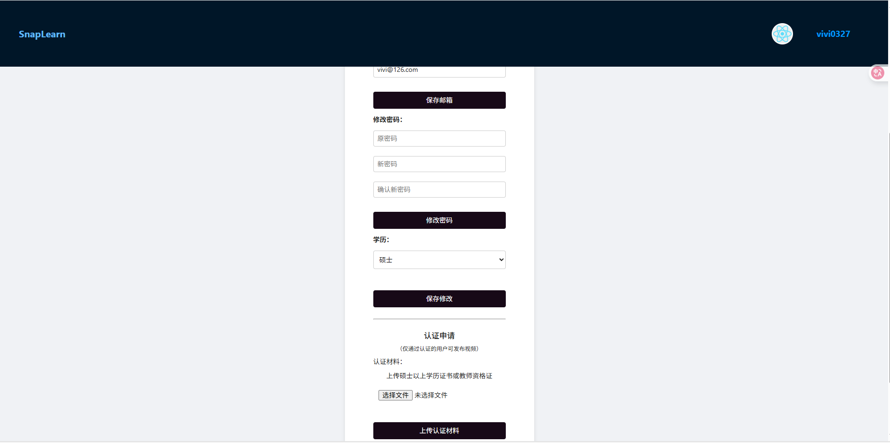

<p align="right">
  🌐 语言切换：
  <a href="README.md">中文</a> |
  <a href="README.en.md">English</a>
</p>

# 📚 SnapLearn - 让学习像刷短视频一样简单

> **AI × 教育 × 碎片化学习 × 开源社区**
>
> SnapLearn 是一个创新的短视频学习平台，结合认证教师、知识碎片化、学科推荐系统与 AI 辅助学习机制，致力于打造“轻学习”的新范式。我们相信，教育应该开放、智能、有趣，并由社区共同驱动！

---

## 🎬 什么是 SnapLearn？

SnapLearn 是一个开放平台，旨在让用户通过**不超过 10 分钟**的短视频高效学习知识。平台只允许**硕士及以上学历**或**拥有教师资格证**的认证教师上传内容，确保教学质量。用户可以根据自己的学历等级和感兴趣的学科个性化筛选内容，并通过 AI 助手进行题目解析、作业批改等操作。

🧩 碎片时间刷视频 → 获取系统知识  
📚 AI+教育技术 → 智能助学体验  
🌍 人人都能学，人人都能教（前提是认证）

---

## 🌟 项目亮点

- **高质量内容保障**：仅认证教师可上传，杜绝低质内容。
- **AI 智能助学**：AI 辅助批改、解题思路引导，提升学习效率。
- **极致碎片化体验**：短视频+滑动流，随时随地高效学习。
- **多维度个性推荐**：支持学历、学科、兴趣等多标签筛选。
- **开源社区共建**：开发者、教师、学习者共同参与，持续进化。

---

## ✨ 项目核心功能

| 功能模块 | 描述 |
|----------|------|
| 🎓 教师认证机制 | 平台仅允许认证教师上传内容，确保教学质量 |
| 🎥 视频上传与分类 | 上传视频需选择所属学科与适合的学历等级，支持多标签筛选 |
| 📱 学习内容流 | 像刷 TikTok 一样“滑动”获取知识，支持按兴趣/学科推送 |
| 📝 附带作业功能（开发中） | 教师可为每个视频添加作业题目，包含主观题与客观题 |
| 🤖 AI 助学系统（规划中） | AI 解题思路引导、不直接给答案，主观题 AI 自动批改 |
| 🔍 高级筛选功能 | 用户可设定“学历等级 + 学科兴趣”过滤推荐内容 |
| 🧠 错题集 & 学习历史（规划中） | 用户可收藏、标记错题与重点内容 |
| 🌟 开源社区驱动 | 欢迎开发者、教育者、设计师、学习者共同参与和贡献 |

---

## 🖼️ 产品预览图

> 👇 欢迎贡献你的截图和演示视频！
- 首页内容流（短视频滑动）
- 视频上传流程
- 教师认证后台
- AI 解题思路演示（草图）

> 示例图：  
>   
> 

---

## 🚀 快速开始（开发者指南）

> 本项目为前后端分离结构，前端基于 React，后端基于 Django REST Framework

### 0️⃣ 环境依赖

- Node.js >= 16
- Python >= 3.8
- Git
- 推荐使用虚拟环境（venv/conda）

### 1️⃣ 克隆仓库

```bash
git clone https://github.com/Yiteng-CHEN/snaplearn.git
cd snaplearn
```

2️⃣ 启动前端（React）
```bash
cd snaplearn-frontend
npm install
npm start
```

3️⃣ 启动后端（Django）
```bash
cd snaplearn_backend
pip install -r requirements.txt
python manage.py migrate
python manage.py runserver
```

4️⃣ （可选）运行测试
```bash
# 前端
npm test
# 后端
python manage.py test
```

💡 常见问题请查阅 [FAQ.md](docs/FAQ.md)

🧠 技术架构概览
- 前端：React, Axios, Ant Design
- 后端：Django, Django REST Framework
- 数据库：SQLite（可扩展至 MySQL/PostgreSQL）
- AI 模块：OpenAI/自研 NLP（规划中）
- 媒体存储：本地或 OSS
- Docker 支持（规划中）

---

## 👥 加入 SnapLearn 社区

SnapLearn 是一个**开放、包容、创新**的教育社区。我们欢迎每一位有志于推动教育创新的人加入，无论你是开发者、教师、设计师还是终身学习者！

### 你可以贡献：

- 💻 新功能开发（前端/后端/AI/NLP）
- 🐞 Bug 修复 & 性能优化
- 🎨 UI/UX 设计优化
- 📚 教学内容建议与视频上传
- 🌍 翻译与国际化（i18n）
- 📢 社区推广与文档完善

> 👉 查看详细贡献说明：[CONTRIBUTING.md](CONTRIBUTING.md)  
> 👉 提交 Issue：[GitHub Issues](https://github.com/Yiteng-CHEN/snaplearn/issues)  
> 👉 参与讨论：[GitHub Discussions](https://github.com/Yiteng-CHEN/snaplearn/discussions)  

> ⚠️ 如遇 404 错误，请先在 GitHub 仓库设置中启用 Discussions 功能：  
> 仓库主页 → Settings → Features → 勾选 Discussions

---

## 📌 路线图（Roadmap）

- ✅ 教师认证 + 视频上传
- ✅ 视频浏览 + 内容流系统
- ✅ 作业上传与答案隐藏机制
- ✅ AI 主观题批改引擎
- 🚧 AI 解题思路引导系统
- ✅ 用户端错题集、收藏夹
- 🚧 支持多语言（国际化）
- 🚧 Docker 一键部署
- 🚧 移动端 App（Flutter/React Native）

---

## 💬 社区与联系我们

| 渠道                    | 状态                                                    |
| --------------------- | ----------------------------------------------------- |
| 💬 GitHub Discussions | ✅ [开放讨论区](https://github.com/Yiteng-CHEN/snaplearn/discussions) |
| 📧 邮件联系               | [eatonchen@hotmail.com](mailto:eatonchen@hotmail.com) |
| 👥 微信交流群 / Telegram   | 🕐 敬请期待（开发中）                                          |

---

## 📄 开源协议

本项目基于 MIT 协议开源，意味着你可以自由使用、修改、分发，甚至商用，只需保留原始版权说明。

---

## 🙌 致谢 & 呼吁

SnapLearn 的愿景是：让每个人都能在碎片时间高效学习，获得高质量教育资源。  
我们相信，通过开源的力量，我们能共同构建一个有知识、有温度、有创新的学习社区。

如果你：

- 是开发者 👉 欢迎提 PR & Issue
- 是教育者 👉 欢迎成为认证教师上传内容
- 是学生或终身学习者 👉 欢迎使用并反馈你的体验
- 是设计师 👉 欢迎参与界面与体验设计

⭐ **Star 本项目，开启下一代教育平台的可能性。让我们一起用代码改变教育！**

> 欢迎任何建议、反馈和 PR，期待你的加入！

## 致谢

